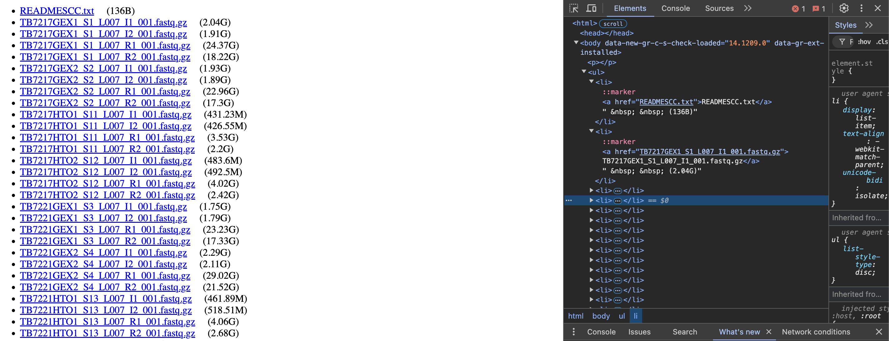

# Web to S3 File Uploader

## Description

This Python script automates the process of downloading files from a webpage and uploading them to an AWS S3 bucket. I use it to download files sequenced in the NovaSeqX from the NY Genome Center. 
It specifically:

- Scrapes a given webpage for file links
- Organizes files based on TB ('Tissue Bank' ID) and Tissue number (e.g. TB7217)
- Provides both dry-run and execution modes
- Maintains the original file structure when uploading to S3

### HTML appearance

The webpage used by the NY Genome Center looks as follows (attached). The webpage contains the linked files inside the following hierarchical organization: `<ul<li><a></a></li><li><a></a></li>...</ul'.


## System Requirements

- UNIX-based operating system (Linux, macOS)
- Python 3.7 or higher
- AWS CLI configured with appropriate credentials

## Installation

### 1. Clone the repository

```
git clone https://github.com/yourusername/web-to-s3-uploader.gitcd web-to-s3-uploader
```

### 2. Set up a virtual environment (recommended)

```
python3 -m venv venvsource venv/bin/activate  # On Linux/macOS
# Or
conda create -n "venv" python=3.7
```

### 3. Install required packages

Install the following packages using pip:

```
beautifulsoup4>=4.9.3requests>=2.25.1boto3>=1.17.78
```

Or simply use:

```
pip install -r requirements.txt
```

### 4. Configure AWS credentials

Ensure your AWS credentials are configured either through:

- AWS CLI (`aws configure`)
- Environment variables
- IAM role (if running on AWS infrastructure)

## Usage

### Basic Command Structure

```
./s3_upload_organizer.py --url <webpage_url> --s3-path <s3_destination> [--execute]
```

### Command Line Arguments

- `--url`: (Required) The base URL of the webpage containing the files
- `--s3-path`: (Required) The S3 destination path (must start with 's3://')
- `--dry-run`: (Default: True) Show what would be done without uploading
- `--execute`: Actually perform the upload (overrides --dry-run)

### Example Commands

1. Dry run (preview what would be uploaded):

```
./s3_upload_organizer.py --url https://example.com/files/ --s3-path s3://my-bucket/prefix/
```

1. Execute the actual upload:

```
./s3_upload_organizer.py --url https://example.com/files/ --s3-path s3://my-bucket/prefix/ --execute
```

## AWS Permissions Required

Ensure your AWS credentials have the following permissions:

- `s3:PutObject`
- `s3:ListBucket`

Example IAM policy:

```
{    "Version": "2012-10-17",    "Statement": [        {            "Effect": "Allow",            "Action": [                "s3:PutObject",                "s3:ListBucket"            ],            "Resource": [                "arn:aws:s3:::your-bucket-name",                "arn:aws:s3:::your-bucket-name/*"            ]        }    ]}
```

## Error Handling

The script includes error handling for common issues:

- Invalid URL format
- Invalid S3 path format
- Network connectivity issues
- AWS credentials/permissions issues
- File access problems

## Limitations

- Only works with publicly accessible webpages
- Requires proper AWS credentials configuration
- Designed for UNIX-based systems

## Contributing

1. Fork the repository
1. Create a feature branch
1. Commit your changes
1. Push to the branch
1. Create a Pull Request

## License

This project is licensed under the [MIT License](LICENSE)

## Author

Josue Curto Navarro

## Version History

- 1.0.0 (2024-01-25): Initial release

<br>
